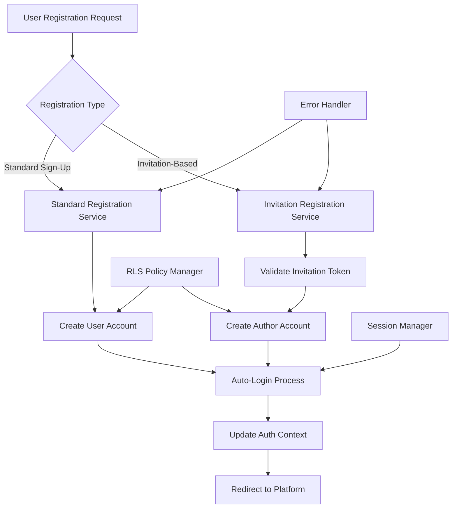

# Design Document

## Overview

This design addresses two critical authentication flow issues: (1) standard sign-up not automatically logging users in, and (2) invitation-based author registration failing due to RLS policy violations. The solution involves modifying authentication services, updating RLS policies, and ensuring proper session management across both registration flows.

## Architecture

### Current Authentication Flow Issues

1. **Standard Sign-Up Flow**: Creates account but doesn't establish session
2. **Invitation Registration Flow**: Fails at profile creation due to insufficient RLS permissions
3. **Session Management**: Inconsistent state updates after registration

### Proposed Solution Architecture



## Components and Interfaces

### 1. Enhanced Authentication Service

**File**: `src/services/authService.ts`

**Responsibilities**:
- Handle standard sign-up with auto-login
- Manage invitation-based registration
- Coordinate with RLS policy management
- Ensure consistent session establishment

**Key Methods**:
```typescript
interface AuthService {
  signUpWithAutoLogin(userData: SignUpData): Promise<AuthResult>
  registerWithInvitation(invitationData: InvitationRegistrationData): Promise<AuthResult>
  establishSession(user: User): Promise<void>
  handleRegistrationError(error: Error): Promise<ErrorResponse>
}
```

### 2. RLS Policy Manager

**File**: `src/services/rlsPolicyManager.ts`

**Responsibilities**:
- Manage profile creation permissions
- Handle service role operations for registration
- Bypass RLS policies when appropriate for user creation
- Maintain security while enabling registration

**Key Methods**:
```typescript
interface RLSPolicyManager {
  createProfileWithServiceRole(profileData: ProfileData): Promise<Profile>
  validateRegistrationPermissions(context: AuthContext): Promise<boolean>
  bypassRLSForRegistration(operation: () => Promise<any>): Promise<any>
}
```

### 3. Registration Flow Coordinator

**File**: `src/services/registrationFlowCoordinator.ts`

**Responsibilities**:
- Orchestrate complete registration process
- Handle both standard and invitation flows
- Manage rollback on failures
- Coordinate between authentication and profile creation

### 4. Enhanced Invitation Service

**File**: `src/services/invitationService.ts` (Enhanced)

**Additional Methods**:
```typescript
interface InvitationService {
  processInvitationRegistration(token: string, userData: UserData): Promise<AuthResult>
  createAuthorProfile(userId: string, invitationData: InvitationData): Promise<Profile>
  assignAuthorPermissions(userId: string): Promise<void>
}
```

## Data Models

### Registration Request Models

```typescript
interface StandardSignUpData {
  email: string
  password: string
  firstName: string
  lastName: string
  acceptedTerms: boolean
}

interface InvitationRegistrationData {
  token: string
  email: string
  password: string
  firstName: string
  lastName: string
  acceptedTerms: boolean
}

interface AuthResult {
  success: boolean
  user?: User
  session?: Session
  error?: string
  redirectUrl?: string
}
```

### Enhanced Profile Creation Model

```typescript
interface ProfileCreationContext {
  userId: string
  userData: UserData
  registrationType: 'standard' | 'invitation'
  bypassRLS: boolean
  serviceRoleRequired: boolean
}
```

## Error Handling

### Error Categories

1. **Validation Errors**: Form field validation failures
2. **RLS Policy Errors**: Permission-related failures during profile creation
3. **Network Errors**: API communication failures
4. **Session Errors**: Authentication state management issues
5. **Invitation Errors**: Token validation or expiration issues

### Error Handling Strategy

```typescript
interface ErrorHandlingStrategy {
  handleValidationError(error: ValidationError): UserFriendlyError
  handleRLSError(error: RLSError): Promise<RetryableError | FatalError>
  handleNetworkError(error: NetworkError): RetryableError
  handleSessionError(error: SessionError): Promise<void>
  handleInvitationError(error: InvitationError): UserFriendlyError
}
```

### Retry Mechanisms

- **Network failures**: Exponential backoff with 3 retry attempts
- **RLS policy failures**: Automatic retry with service role escalation
- **Session establishment failures**: Immediate retry with fresh token

## Testing Strategy

### Unit Tests

1. **Authentication Service Tests**
   - Standard sign-up with auto-login flow
   - Invitation registration flow
   - Error handling scenarios
   - Session establishment verification

2. **RLS Policy Manager Tests**
   - Service role profile creation
   - Permission validation
   - RLS bypass mechanisms
   - Security constraint maintenance

3. **Registration Flow Coordinator Tests**
   - End-to-end registration flows
   - Rollback scenarios
   - Error propagation
   - State consistency

### Integration Tests

1. **Complete Registration Flows**
   - Standard sign-up to platform access
   - Invitation link to author dashboard
   - Error recovery scenarios
   - Cross-component state synchronization

2. **Database Integration Tests**
   - Profile creation with various permission contexts
   - RLS policy compliance verification
   - Transaction rollback scenarios
   - Data consistency validation

### End-to-End Tests

1. **User Journey Tests**
   - Complete sign-up flow from home page
   - Complete invitation registration flow
   - Authentication state persistence
   - Error handling user experience

## Security Considerations

### RLS Policy Management

- **Principle of Least Privilege**: Only bypass RLS when absolutely necessary for registration
- **Audit Trail**: Log all RLS bypasses and service role operations
- **Temporary Escalation**: Use service role permissions only during registration process
- **Validation**: Verify user data before any privilege escalation

### Session Security

- **Secure Session Establishment**: Use proper Supabase session management
- **Token Validation**: Verify invitation tokens before processing
- **CSRF Protection**: Maintain CSRF protection during registration
- **Rate Limiting**: Implement registration attempt rate limiting

### Data Protection

- **Input Sanitization**: Sanitize all user input before processing
- **Password Security**: Ensure proper password hashing and validation
- **Email Validation**: Validate email formats and prevent injection
- **Personal Data**: Handle personal data according to privacy requirements

## Implementation Phases

### Phase 1: Standard Sign-Up Auto-Login
1. Modify sign-up service to establish session after account creation
2. Update authentication context management
3. Remove email confirmation requirement
4. Test complete flow from sign-up to platform access

### Phase 2: RLS Policy Resolution
1. Implement RLS policy manager with service role capabilities
2. Create profile creation service with proper permissions
3. Update database policies to allow registration operations
4. Test profile creation scenarios

### Phase 3: Invitation Registration Fix
1. Enhance invitation service with proper profile creation
2. Integrate RLS policy manager with invitation flow
3. Implement author permission assignment
4. Test complete invitation registration flow

### Phase 4: Error Handling and Polish
1. Implement comprehensive error handling
2. Add retry mechanisms and fallback options
3. Enhance user feedback and messaging
4. Conduct end-to-end testing and validation

## Database Schema Updates

### RLS Policy Modifications

```sql
-- Allow profile creation during registration with service role
CREATE POLICY "Allow profile creation during registration" ON profiles
  FOR INSERT WITH CHECK (
    auth.role() = 'service_role' OR 
    auth.uid() = user_id
  );

-- Allow profile updates for new users
CREATE POLICY "Allow profile updates for owners" ON profiles
  FOR UPDATE USING (auth.uid() = user_id);
```

### Registration Context Table

```sql
CREATE TABLE registration_contexts (
  id UUID PRIMARY KEY DEFAULT gen_random_uuid(),
  user_id UUID REFERENCES auth.users(id),
  registration_type TEXT NOT NULL,
  created_at TIMESTAMP WITH TIME ZONE DEFAULT NOW(),
  completed_at TIMESTAMP WITH TIME ZONE,
  metadata JSONB
);
```

## Monitoring and Observability

### Metrics to Track

1. **Registration Success Rates**: Track completion rates for both flows
2. **RLS Policy Violations**: Monitor and alert on policy failures
3. **Session Establishment**: Track auto-login success rates
4. **Error Rates**: Monitor different error categories
5. **User Journey Completion**: Track from registration to first platform interaction

### Logging Strategy

1. **Registration Events**: Log all registration attempts and outcomes
2. **RLS Operations**: Log service role usage and policy bypasses
3. **Error Details**: Capture detailed error information for debugging
4. **Performance Metrics**: Track registration flow performance
5. **Security Events**: Log authentication and authorization events

This design ensures both registration flows work seamlessly while maintaining security and providing excellent user experience.