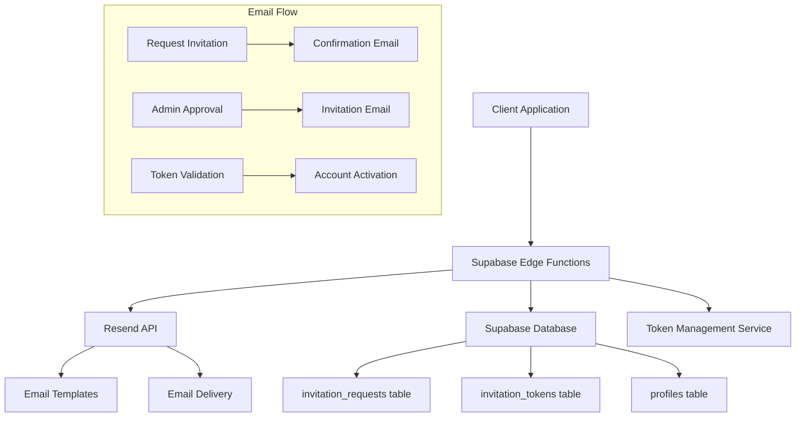

# Design Document

## Overview

The Email Notification System will integrate Resend as the primary email service provider to handle transactional and notification emails for the platform. The system will be built using Supabase Edge Functions to ensure server-side execution and avoid CORS restrictions. The core focus is implementing a secure invitation flow where users can request invitations to become authors, receive confirmation emails, and complete account activation through tokenized invitation links.

The system will extend the existing invitation request functionality with email capabilities, secure token management, and role elevation workflows. All email operations will be handled server-side through Edge Functions, with proper error handling and security measures.

## Architecture

### High-Level Architecture



### System Components

1. **Email Service Layer**: Supabase Edge Functions with Resend integration
2. **Token Management**: Secure token generation, validation, and expiration
3. **Database Layer**: Extended schema for invitation tokens and email tracking
4. **Template System**: HTML email templates with React Email components
5. **Role Management**: User role elevation and permission handling

## Components and Interfaces

### 1. Email Service (Edge Function)

**Location**: `supabase/functions/send-email/index.ts`

**Purpose**: Central email service for all transactional emails

**Interface**:
```typescript
interface EmailRequest {
  type: 'invitation_confirmation' | 'invitation_approved' | 'custom';
  to: string;
  templateData: Record<string, any>;
  from?: string;
}

interface EmailResponse {
  success: boolean;
  messageId?: string;
  error?: string;
}
```

**Key Features**:
- Resend API integration
- Template-based email composition
- Error handling and retry logic
- Logging and monitoring

### 2. Invitation Token Service (Edge Function)

**Location**: `supabase/functions/invitation-tokens/index.ts`

**Purpose**: Manage invitation token lifecycle

**Interface**:
```typescript
interface TokenRequest {
  invitationId: string;
  email: string;
  expirationHours?: number;
}

interface TokenValidation {
  token: string;
  email?: string;
}

interface TokenResponse {
  success: boolean;
  token?: string;
  invitationData?: InvitationData;
  error?: string;
}
```

### 3. Enhanced Invitation Service

**Location**: `src/services/invitationService.ts` (extended)

**New Functions**:
```typescript
// Send confirmation email after invitation request
async function sendInvitationConfirmation(invitationId: string): Promise<ServiceResponse>

// Send invitation email with token after approval
async function sendInvitationEmail(invitationId: string): Promise<ServiceResponse>

// Validate invitation token and get invitation data
async function validateInvitationToken(token: string): Promise<ServiceResponse>

// Complete invitation process (activate account or create new)
async function completeInvitation(token: string, userData?: UserData): Promise<ServiceResponse>
```

### 4. Email Templates

**Location**: `supabase/functions/send-email/_templates/`

**Templates**:
- `invitation-confirmation.tsx`: Confirmation email for invitation requests
- `invitation-approved.tsx`: Invitation email with activation link
- `invitation-expired.tsx`: Notification for expired invitations

**Template Interface**:
```typescript
interface InvitationConfirmationProps {
  parentName: string;
  childName: string;
  submissionDate: string;
}

interface InvitationApprovedProps {
  parentName: string;
  childName: string;
  activationUrl: string;
  expirationDate: string;
}
```

## Data Models

### 1. Enhanced Database Schema

**New Table: invitation_tokens**
```sql
CREATE TABLE invitation_tokens (
  id UUID PRIMARY KEY DEFAULT gen_random_uuid(),
  invitation_id UUID NOT NULL REFERENCES invitation_requests(id) ON DELETE CASCADE,
  token_hash TEXT NOT NULL UNIQUE,
  email TEXT NOT NULL,
  expires_at TIMESTAMP WITH TIME ZONE NOT NULL,
  used_at TIMESTAMP WITH TIME ZONE NULL,
  created_at TIMESTAMP WITH TIME ZONE DEFAULT NOW(),
  
  INDEX idx_invitation_tokens_hash (token_hash),
  INDEX idx_invitation_tokens_email (email),
  INDEX idx_invitation_tokens_expires (expires_at)
);
```

**Enhanced invitation_requests table**:
```sql
ALTER TABLE invitation_requests 
ADD COLUMN confirmation_email_sent_at TIMESTAMP WITH TIME ZONE NULL,
ADD COLUMN invitation_email_sent_at TIMESTAMP WITH TIME ZONE NULL,
ADD COLUMN completed_at TIMESTAMP WITH TIME ZONE NULL;
```

### 2. TypeScript Interfaces

```typescript
interface InvitationToken {
  id: string;
  invitation_id: string;
  token_hash: string;
  email: string;
  expires_at: string;
  used_at?: string;
  created_at: string;
}

interface EnhancedInvitationRequest extends InvitationRequest {
  confirmation_email_sent_at?: string;
  invitation_email_sent_at?: string;
  completed_at?: string;
  token?: InvitationToken;
}
```

## Error Handling

### 1. Email Service Error Handling

**Error Categories**:
- **Network Errors**: Resend API connectivity issues
- **Authentication Errors**: Invalid API keys or permissions
- **Validation Errors**: Invalid email addresses or template data
- **Rate Limiting**: Resend API rate limits exceeded

**Error Response Format**:
```typescript
interface EmailError {
  code: string;
  message: string;
  details?: Record<string, any>;
  retryable: boolean;
}
```

**Retry Strategy**:
- Exponential backoff for retryable errors
- Maximum 3 retry attempts
- Circuit breaker pattern for persistent failures

### 2. Token Validation Error Handling

**Error Scenarios**:
- Invalid token format
- Token not found in database
- Token expired
- Token already used
- Email mismatch

**Error Pages**:
- `/invitation/expired`: Token has expired
- `/invitation/invalid`: Token is invalid or not found
- `/invitation/used`: Token has already been used

### 3. Database Error Handling

**Transaction Management**:
- Use database transactions for multi-step operations
- Rollback on any step failure
- Proper error logging and user feedback

## Testing Strategy

### 1. Unit Tests

**Email Service Tests**:
```typescript
describe('EmailService', () => {
  test('should send invitation confirmation email', async () => {
    // Mock Resend API
    // Test email composition and sending
  });
  
  test('should handle Resend API errors gracefully', async () => {
    // Test error handling and retry logic
  });
});
```

**Token Service Tests**:
```typescript
describe('TokenService', () => {
  test('should generate secure tokens', async () => {
    // Test token generation and uniqueness
  });
  
  test('should validate tokens correctly', async () => {
    // Test token validation logic
  });
  
  test('should handle expired tokens', async () => {
    // Test expiration handling
  });
});
```

### 2. Integration Tests

**End-to-End Invitation Flow**:
```typescript
describe('Invitation Flow', () => {
  test('complete invitation flow for new user', async () => {
    // 1. Submit invitation request
    // 2. Verify confirmation email sent
    // 3. Admin approves invitation
    // 4. Verify invitation email sent
    // 5. User clicks invitation link
    // 6. User creates account
    // 7. Verify author role granted
  });
  
  test('complete invitation flow for existing user', async () => {
    // Similar flow but for existing user activation
  });
});
```

### 3. Email Template Tests

**Template Rendering Tests**:
```typescript
describe('Email Templates', () => {
  test('should render invitation confirmation template', async () => {
    // Test template rendering with sample data
  });
  
  test('should handle missing template data gracefully', async () => {
    // Test error handling for incomplete data
  });
});
```

### 4. Security Tests

**Token Security Tests**:
```typescript
describe('Token Security', () => {
  test('should generate cryptographically secure tokens', async () => {
    // Test token randomness and uniqueness
  });
  
  test('should prevent token enumeration attacks', async () => {
    // Test rate limiting and error responses
  });
});
```

## Security Considerations

### 1. Token Security

**Token Generation**:
- Use `crypto.getRandomValues()` for secure random generation
- Minimum 32 bytes of entropy
- Hash tokens before database storage using SHA-256
- Include email in token validation to prevent token hijacking

**Token Storage**:
```typescript
// Generate secure token
const tokenBytes = new Uint8Array(32);
crypto.getRandomValues(tokenBytes);
const token = Array.from(tokenBytes, byte => byte.toString(16).padStart(2, '0')).join('');

// Hash for database storage
const tokenHash = await crypto.subtle.digest('SHA-256', new TextEncoder().encode(token));
```

### 2. Email Security

**Template Security**:
- Sanitize all user input in email templates
- Use parameterized templates to prevent injection
- Validate email addresses before sending

**Rate Limiting**:
- Limit invitation requests per email address (1 per hour)
- Limit token validation attempts (5 per token per hour)
- Implement CAPTCHA for invitation requests

### 3. Database Security

**Access Control**:
- Row Level Security (RLS) policies for invitation_tokens table
- Restrict token access to invitation owner and admins
- Audit logging for all token operations

**RLS Policies**:
```sql
-- Users can only access their own invitation tokens
CREATE POLICY "Users can access own invitation tokens" ON invitation_tokens
  FOR SELECT USING (
    email = auth.jwt() ->> 'email' OR
    EXISTS (
      SELECT 1 FROM profiles 
      WHERE id = auth.uid() 
      AND role IN ('admin', 'moderator')
    )
  );
```

## Performance Considerations

### 1. Email Delivery

**Async Processing**:
- Queue email sending for non-critical emails
- Use Supabase Edge Functions for immediate emails
- Implement retry mechanisms for failed sends

### 2. Token Management

**Database Optimization**:
- Index on token_hash for fast lookups
- Index on expires_at for cleanup operations
- Automatic cleanup of expired tokens via cron job

**Cleanup Strategy**:
```sql
-- Daily cleanup of expired tokens
SELECT cron.schedule(
  'cleanup-expired-tokens',
  '0 2 * * *', -- Daily at 2 AM
  'DELETE FROM invitation_tokens WHERE expires_at < NOW() - INTERVAL ''1 day'''
);
```

### 3. Caching

**Template Caching**:
- Cache compiled email templates in memory
- Invalidate cache on template updates
- Use CDN for static email assets

## Monitoring and Logging

### 1. Email Metrics

**Key Metrics**:
- Email delivery success rate
- Email bounce rate
- Template rendering errors
- API response times

**Monitoring Setup**:
```typescript
// Email service monitoring
const emailMetrics = {
  sent: 0,
  failed: 0,
  bounced: 0,
  delivered: 0
};

// Log email events
function logEmailEvent(event: EmailEvent) {
  console.log(JSON.stringify({
    timestamp: new Date().toISOString(),
    event: event.type,
    email: event.email,
    template: event.template,
    success: event.success,
    error: event.error
  }));
}
```

### 2. Token Analytics

**Security Monitoring**:
- Failed token validation attempts
- Token enumeration attempts
- Suspicious access patterns

### 3. Error Tracking

**Error Categories**:
- Email service errors
- Token validation errors
- Database connection errors
- Template rendering errors

**Error Alerting**:
- Real-time alerts for critical errors
- Daily summaries of error rates
- Integration with monitoring services