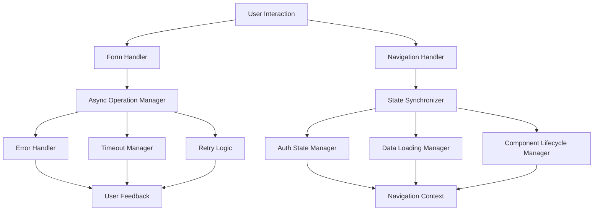

# Design Document

## Overview

This design addresses critical frontend issues in the application by implementing robust error handling, improved state management, and better component lifecycle management. The solution focuses on two main problem areas: form submission reliability and navigation-related data loading issues.

Based on code analysis, the issues stem from:
1. **Form Submission**: Async operations getting stuck without proper error handling or timeout mechanisms
2. **Navigation Loading**: Race conditions between authentication state, data fetching, and component lifecycle management
3. **State Management**: Inconsistent loading states and authentication synchronization across navigation

## Architecture

### Core Components



### Data Flow

1. **Form Submission Flow**:
   - User clicks submit → Immediate logging and state update
   - Validation → Service call with timeout
   - Response handling → State reset and user feedback

2. **Navigation Flow**:
   - Navigation event → Cleanup previous states
   - Auth sync → Data fetching with proper lifecycle management
   - Component mounting → Proper cleanup on unmount

## Components and Interfaces

### 1. Enhanced Form Handler

**Location**: `src/pages/RequestInvitation.tsx`

**Enhancements**:
```typescript
interface FormSubmissionState {
  isSubmitting: boolean;
  submissionId: string | null;
  timeoutId: NodeJS.Timeout | null;
  retryCount: number;
}

interface FormSubmissionConfig {
  timeout: number;
  maxRetries: number;
  retryDelay: number;
}
```

**Key Features**:
- Comprehensive logging at each step
- Timeout handling with automatic reset
- Retry mechanism with exponential backoff
- Proper cleanup on component unmount
- Detailed error reporting with actionable messages

### 2. Async Operation Manager

**Location**: `src/utils/asyncOperationManager.ts` (new)

**Purpose**: Centralized handling of async operations with timeout, retry, and error handling

```typescript
interface AsyncOperationOptions {
  timeout?: number;
  maxRetries?: number;
  retryDelay?: number;
  onProgress?: (step: string) => void;
  onError?: (error: any, attempt: number) => void;
}

class AsyncOperationManager {
  static async executeWithRetry<T>(
    operation: () => Promise<T>,
    options: AsyncOperationOptions
  ): Promise<T>;
}
```

### 3. Enhanced Navigation Context

**Location**: `src/contexts/NavigationContext.tsx`

**Enhancements**:
- Improved navigation-change event handling
- State cleanup coordination
- Loading state management across components

### 4. Improved Auth Provider

**Location**: `src/providers/AuthProvider.tsx`

**Enhancements**:
- Reduced retry attempts to minimize interference
- Better error handling in establishSession
- Optimized session synchronization
- Proper cleanup of auth-related operations

### 5. Enhanced Data Fetching

**Location**: `src/data/articles/index.ts`

**Enhancements**:
- Proper timeout handling
- Better error logging and recovery
- Component unmount protection
- Graceful degradation when data is unavailable

### 6. Component Lifecycle Manager

**Location**: `src/utils/componentLifecycleManager.ts` (new)

**Purpose**: Standardized component lifecycle management

```typescript
interface LifecycleManager {
  isMounted: boolean;
  timeouts: Set<NodeJS.Timeout>;
  intervals: Set<NodeJS.Interval>;
  eventListeners: Map<string, EventListener>;
  
  addTimeout(callback: () => void, delay: number): NodeJS.Timeout;
  addInterval(callback: () => void, delay: number): NodeJS.Interval;
  addEventListener(event: string, listener: EventListener): void;
  cleanup(): void;
}
```

## Data Models

### Form Submission Tracking

```typescript
interface FormSubmissionLog {
  submissionId: string;
  timestamp: number;
  formData: Record<string, any>;
  status: 'started' | 'validating' | 'submitting' | 'success' | 'error' | 'timeout';
  error?: string;
  retryCount: number;
  duration?: number;
}
```

### Navigation State

```typescript
interface NavigationState {
  currentPath: string;
  previousPath: string;
  isNavigating: boolean;
  loadingStates: Map<string, boolean>;
  authSyncInProgress: boolean;
}
```

### Component State Tracking

```typescript
interface ComponentState {
  componentId: string;
  isMounted: boolean;
  loadingOperations: Set<string>;
  activeTimeouts: Set<NodeJS.Timeout>;
  eventListeners: Map<string, EventListener>;
}
```

## Error Handling

### 1. Form Submission Errors

**Categories**:
- **Validation Errors**: Field-level validation with specific messages
- **Network Errors**: Timeout, connection issues, server errors
- **Service Errors**: Rate limiting, database issues, Edge Function failures
- **Unexpected Errors**: Unhandled exceptions with fallback messaging

**Handling Strategy**:
```typescript
interface ErrorHandlingStrategy {
  immediate: {
    logError: boolean;
    showUserMessage: boolean;
    resetFormState: boolean;
  };
  retry: {
    enabled: boolean;
    maxAttempts: number;
    backoffStrategy: 'linear' | 'exponential';
  };
  fallback: {
    alternativeAction?: () => void;
    userGuidance: string;
  };
}
```

### 2. Navigation and Loading Errors

**Categories**:
- **Data Fetch Errors**: API failures, timeout, empty responses
- **Auth State Errors**: Session issues, profile loading failures
- **Component Lifecycle Errors**: Memory leaks, race conditions

**Recovery Mechanisms**:
- Automatic retry with exponential backoff
- Graceful degradation (show partial content)
- User-initiated retry buttons
- Fallback to cached data when available

### 3. Centralized Error Reporting

**Location**: `src/utils/errorReporting.ts` (enhanced)

```typescript
interface ErrorReport {
  errorId: string;
  timestamp: number;
  component: string;
  operation: string;
  error: Error;
  context: Record<string, any>;
  userAgent: string;
  url: string;
}
```

## Testing Strategy

### 1. Unit Tests

**Form Submission**:
- Test timeout handling
- Test retry logic
- Test error state management
- Test cleanup on unmount

**Navigation**:
- Test state cleanup
- Test event listener management
- Test component lifecycle

**Data Fetching**:
- Test error handling
- Test timeout behavior
- Test graceful degradation

### 2. Integration Tests

**End-to-End Form Flow**:
- Submit form with network delays
- Test form submission with server errors
- Test navigation during form submission

**Navigation Flow**:
- Test rapid navigation between pages
- Test auth state consistency during navigation
- Test data loading after authentication

### 3. Error Simulation Tests

**Network Issues**:
- Simulate timeout scenarios
- Simulate intermittent connectivity
- Simulate server errors

**Race Conditions**:
- Simulate rapid user interactions
- Simulate component unmounting during operations
- Simulate concurrent auth state changes

## Implementation Phases

### Phase 1: Form Submission Reliability
1. Implement AsyncOperationManager utility
2. Enhance RequestInvitation form with comprehensive logging
3. Add timeout and retry mechanisms
4. Implement proper error handling and user feedback

### Phase 2: Navigation State Management
1. Enhance NavigationContext with better state management
2. Implement ComponentLifecycleManager utility
3. Update AuthProvider with optimized session handling
4. Add proper cleanup mechanisms

### Phase 3: Data Loading Improvements
1. Enhance article data fetching with timeout handling
2. Implement graceful error recovery
3. Add proper component unmount protection
4. Optimize loading state management

### Phase 4: Monitoring and Debugging
1. Implement comprehensive error reporting
2. Add performance monitoring
3. Create debugging utilities
4. Add user feedback mechanisms

## Performance Considerations

### 1. Reduced Auth Retries
- Limit auth profile retries to 2 attempts
- Use shorter delays between retries (500ms instead of 1000ms)
- Implement proper timeout handling

### 2. Optimized State Updates
- Use memoized context values to prevent unnecessary re-renders
- Implement debounced state updates for rapid interactions
- Use proper dependency arrays in useEffect hooks

### 3. Memory Management
- Implement proper cleanup of timeouts and intervals
- Remove event listeners on component unmount
- Cancel pending requests when components unmount

### 4. Network Optimization
- Implement request deduplication
- Use proper caching strategies
- Implement retry with exponential backoff

## Security Considerations

### 1. Error Information Disclosure
- Sanitize error messages shown to users
- Log detailed errors server-side only
- Avoid exposing internal system details

### 2. Rate Limiting
- Implement client-side rate limiting for form submissions
- Respect server-side rate limits
- Provide clear feedback when rate limited

### 3. Input Validation
- Maintain existing input sanitization
- Add client-side validation for better UX
- Ensure server-side validation remains primary

## Monitoring and Alerting

### 1. Error Tracking
- Track form submission failure rates
- Monitor navigation-related errors
- Alert on unusual error patterns

### 2. Performance Monitoring
- Track form submission times
- Monitor page load times
- Track authentication state sync times

### 3. User Experience Metrics
- Track user abandonment rates on forms
- Monitor navigation success rates
- Track error recovery success rates