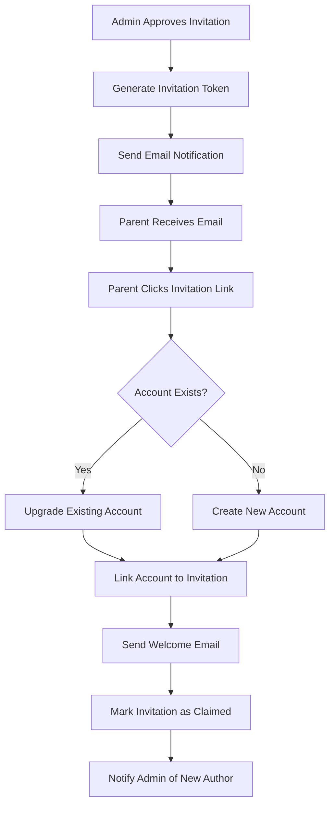

# Design Document

## Overview

This design implements a complete post-approval workflow for parent invitation requests, including email notifications, secure token-based account creation, and comprehensive admin management tools. The system integrates with Supabase's email service and extends the existing invitation management infrastructure.

The design follows a secure, user-friendly approach that guides parents through the account creation process while maintaining platform safety standards and providing administrators with full visibility and control over the invitation lifecycle.

## Architecture

### System Components



### Database Schema Extensions

The design requires extending the existing database schema with new tables and modifications:

#### New Tables

1. **invitation_tokens**
   - `id` (UUID, primary key)
   - `invitation_request_id` (UUID, foreign key to invitation_requests)
   - `token` (TEXT, unique, encrypted)
   - `expires_at` (TIMESTAMP)
   - `used_at` (TIMESTAMP, nullable)
   - `created_at` (TIMESTAMP)

2. **email_notifications**
   - `id` (UUID, primary key)
   - `invitation_request_id` (UUID, foreign key to invitation_requests)
   - `email_type` (ENUM: 'approval', 'denial', 'welcome', 'expiry_warning')
   - `recipient_email` (TEXT)
   - `sent_at` (TIMESTAMP)
   - `delivery_status` (ENUM: 'pending', 'sent', 'failed', 'bounced')
   - `error_message` (TEXT, nullable)
   - `created_at` (TIMESTAMP)

#### Modified Tables

1. **invitation_requests** (add columns)
   - `invitation_claimed_at` (TIMESTAMP, nullable)
   - `notification_sent_at` (TIMESTAMP, nullable)
   - `notification_status` (ENUM: 'pending', 'sent', 'failed')

### Email Service Integration

The system will use Supabase's built-in email functionality with custom templates:

#### Email Templates

1. **Approval Email Template**
   - Subject: "Great News! [Child Name] has been approved for The Flying Bus"
   - Includes invitation link with token
   - Platform overview and safety information
   - Clear next steps

2. **Denial Email Template**
   - Subject: "Update on your Flying Bus invitation request"
   - Polite explanation
   - Information about reapplying

3. **Welcome Email Template**
   - Subject: "Welcome to The Flying Bus Author Community!"
   - Onboarding information
   - Safety guidelines and platform rules
   - Getting started guide

4. **Expiry Warning Email Template**
   - Subject: "Your Flying Bus invitation expires soon"
   - Instructions to contact support
   - Reapplication information

## Components and Interfaces

### Backend Services

#### EmailNotificationService
```typescript
interface EmailNotificationService {
  sendApprovalEmail(invitationId: string): Promise<EmailResult>
  sendDenialEmail(invitationId: string): Promise<EmailResult>
  sendWelcomeEmail(userId: string, invitationId: string): Promise<EmailResult>
  sendExpiryWarningEmail(invitationId: string): Promise<EmailResult>
  getNotificationStatus(invitationId: string): Promise<NotificationStatus>
}
```

#### InvitationTokenService
```typescript
interface InvitationTokenService {
  generateToken(invitationId: string): Promise<InvitationToken>
  validateToken(token: string): Promise<TokenValidation>
  markTokenAsUsed(token: string, userId: string): Promise<void>
  getTokenStatus(token: string): Promise<TokenStatus>
  regenerateToken(invitationId: string): Promise<InvitationToken>
}
```

#### InvitationClaimService
```typescript
interface InvitationClaimService {
  claimInvitation(token: string, userEmail: string): Promise<ClaimResult>
  upgradeExistingUser(userId: string, invitationId: string): Promise<void>
  createNewAuthorAccount(invitationData: InvitationData): Promise<User>
  linkInvitationToUser(invitationId: string, userId: string): Promise<void>
}
```

### Frontend Components

#### InvitationClaimPage
- Route: `/claim-invitation/:token`
- Validates token and shows appropriate UI
- Handles both new account creation and existing account upgrade
- Provides clear error messages and support information

#### Enhanced InvitationManagement
- Shows email notification status
- Displays invitation claim status
- Provides token regeneration functionality
- Shows linked user accounts

#### InvitationStatusBadge
- Visual indicator for invitation lifecycle status
- Shows: Pending → Approved → Email Sent → Claimed
- Color-coded for quick admin reference

## Data Models

### InvitationToken
```typescript
interface InvitationToken {
  id: string
  invitationRequestId: string
  token: string
  expiresAt: Date
  usedAt?: Date
  createdAt: Date
}
```

### EmailNotification
```typescript
interface EmailNotification {
  id: string
  invitationRequestId: string
  emailType: 'approval' | 'denial' | 'welcome' | 'expiry_warning'
  recipientEmail: string
  sentAt?: Date
  deliveryStatus: 'pending' | 'sent' | 'failed' | 'bounced'
  errorMessage?: string
  createdAt: Date
}
```

### Enhanced InvitationRequest
```typescript
interface EnhancedInvitationRequest extends InvitationRequest {
  invitationClaimedAt?: Date
  notificationSentAt?: Date
  notificationStatus: 'pending' | 'sent' | 'failed'
  token?: InvitationToken
  notifications: EmailNotification[]
}
```

## Error Handling

### Email Delivery Failures
- Retry mechanism with exponential backoff
- Admin notifications for persistent failures
- Fallback to manual admin intervention
- Detailed logging for troubleshooting

### Token Security
- Secure token generation using crypto.randomBytes
- Token expiration handling
- Rate limiting on token validation attempts
- Audit logging for security events

### Account Creation Errors
- Graceful handling of duplicate accounts
- Clear error messages for users
- Admin notifications for technical issues
- Rollback mechanisms for partial failures

## Testing Strategy

### Unit Tests
- Email service functionality
- Token generation and validation
- Account creation and upgrade logic
- Database operations and transactions

### Integration Tests
- Complete invitation claim flow
- Email delivery and template rendering
- Database consistency across operations
- Error handling and recovery scenarios

### End-to-End Tests
- Full parent invitation journey
- Admin management workflows
- Email notification delivery
- Security and edge cases

### Manual Testing Checklist
- Email template rendering across clients
- Invitation link functionality
- Admin dashboard enhancements
- Error message clarity and helpfulness

## Security Considerations

### Token Security
- Cryptographically secure token generation
- Short expiration times (30 days)
- One-time use enforcement
- Secure transmission over HTTPS only

### Email Security
- SPF/DKIM configuration for email authentication
- Rate limiting on email sending
- Bounce and complaint handling
- Secure template rendering to prevent injection

### Account Security
- Email verification for account upgrades
- Role assignment validation
- Audit logging for all privilege changes
- Protection against account takeover attempts

## Performance Considerations

### Email Sending
- Asynchronous email processing
- Queue-based email delivery
- Batch processing for bulk operations
- Monitoring and alerting for delivery issues

### Database Operations
- Indexed queries for token lookups
- Efficient joins for invitation data
- Connection pooling for high concurrency
- Caching for frequently accessed data

## Supabase Configuration Requirements

### Database Setup
You will need to execute the following SQL commands in the Supabase SQL Editor:

```sql
-- Create invitation_tokens table
CREATE TABLE invitation_tokens (
  id UUID DEFAULT gen_random_uuid() PRIMARY KEY,
  invitation_request_id UUID NOT NULL REFERENCES invitation_requests(id) ON DELETE CASCADE,
  token TEXT NOT NULL UNIQUE,
  expires_at TIMESTAMP WITH TIME ZONE NOT NULL,
  used_at TIMESTAMP WITH TIME ZONE,
  created_at TIMESTAMP WITH TIME ZONE DEFAULT NOW()
);

-- Create email_notifications table
CREATE TYPE email_type AS ENUM ('approval', 'denial', 'welcome', 'expiry_warning');
CREATE TYPE delivery_status AS ENUM ('pending', 'sent', 'failed', 'bounced');

CREATE TABLE email_notifications (
  id UUID DEFAULT gen_random_uuid() PRIMARY KEY,
  invitation_request_id UUID NOT NULL REFERENCES invitation_requests(id) ON DELETE CASCADE,
  email_type email_type NOT NULL,
  recipient_email TEXT NOT NULL,
  sent_at TIMESTAMP WITH TIME ZONE,
  delivery_status delivery_status DEFAULT 'pending',
  error_message TEXT,
  created_at TIMESTAMP WITH TIME ZONE DEFAULT NOW()
);

-- Add columns to invitation_requests table
ALTER TABLE invitation_requests 
ADD COLUMN invitation_claimed_at TIMESTAMP WITH TIME ZONE,
ADD COLUMN notification_sent_at TIMESTAMP WITH TIME ZONE,
ADD COLUMN notification_status TEXT DEFAULT 'pending';

-- Create indexes for performance
CREATE INDEX idx_invitation_tokens_token ON invitation_tokens(token);
CREATE INDEX idx_invitation_tokens_invitation_id ON invitation_tokens(invitation_request_id);
CREATE INDEX idx_email_notifications_invitation_id ON email_notifications(invitation_request_id);
CREATE INDEX idx_invitation_requests_status ON invitation_requests(status);

-- Create function to automatically generate tokens on approval
CREATE OR REPLACE FUNCTION generate_invitation_token()
RETURNS TRIGGER AS $$
BEGIN
  -- Only generate token when status changes to 'approved'
  IF NEW.status = 'approved' AND OLD.status != 'approved' THEN
    INSERT INTO invitation_tokens (invitation_request_id, token, expires_at)
    VALUES (
      NEW.id,
      encode(gen_random_bytes(32), 'base64url'),
      NOW() + INTERVAL '30 days'
    );
  END IF;
  RETURN NEW;
END;
$$ LANGUAGE plpgsql;

-- Create trigger to auto-generate tokens
CREATE TRIGGER trigger_generate_invitation_token
  AFTER UPDATE ON invitation_requests
  FOR EACH ROW
  EXECUTE FUNCTION generate_invitation_token();
```

### Email Configuration
You will need to configure Supabase Auth email templates:

1. Go to Authentication > Email Templates in your Supabase dashboard
2. Create custom email templates for the invitation system
3. Configure SMTP settings if using custom email provider
4. Set up email rate limiting and bounce handling

### Row Level Security (RLS)
```sql
-- Enable RLS on new tables
ALTER TABLE invitation_tokens ENABLE ROW LEVEL SECURITY;
ALTER TABLE email_notifications ENABLE ROW LEVEL SECURITY;

-- Create policies for invitation_tokens
CREATE POLICY "Admin can manage invitation tokens" ON invitation_tokens
  FOR ALL USING (is_admin());

-- Create policies for email_notifications  
CREATE POLICY "Admin can view email notifications" ON email_notifications
  FOR SELECT USING (is_admin());
```

### Environment Variables
Add these to your Supabase project settings:
- `INVITATION_TOKEN_EXPIRY_DAYS=30`
- `EMAIL_RATE_LIMIT_PER_HOUR=100`
- `INVITATION_BASE_URL=https://yourapp.com/claim-invitation`