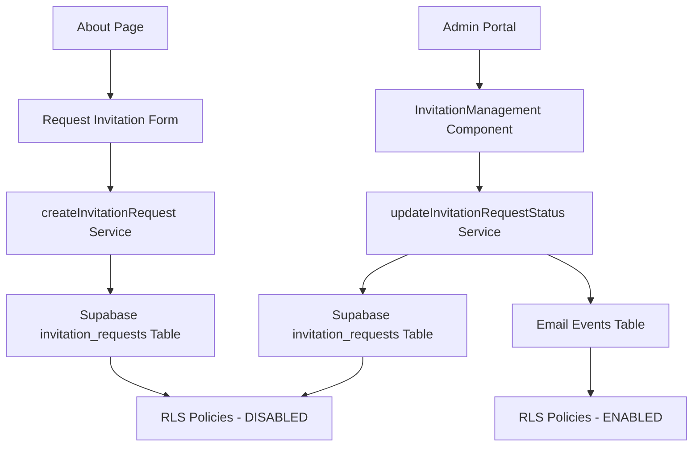

# Design Document

## Overview

This design addresses critical issues in the invitation request form and admin approval system. The system currently has two main problems:

1. **Form Submission Issue**: The invitation request form on the About page fails to submit when users are logged in, but works when anonymous
2. **Admin Approval Issue**: Admins cannot approve invitation requests due to RLS policy violations and 403 Forbidden errors

The root causes are authentication context conflicts and inconsistent RLS policy implementation across the invitation workflow.

## Architecture

### Current System Architecture



### Problem Areas Identified

1. **Authentication Context Mismatch**: Form submission logic doesn't properly handle authenticated vs anonymous users
2. **RLS Policy Inconsistency**: `invitation_requests` table has RLS disabled but `email_events` has restrictive policies
3. **Service Role Access**: Admin operations require service role permissions but are executed with user context
4. **Email Event Logging**: Email operations fail due to RLS policy violations on `email_events` table

## Components and Interfaces

### 1. Authentication Context Handler

**Purpose**: Ensure consistent authentication handling across invitation workflow

**Interface**:
```typescript
interface AuthenticationContext {
  isAuthenticated: boolean;
  user: User | null;
  role: 'anon' | 'authenticated' | 'service_role';
  canSubmitInvitation: boolean;
  canApproveInvitations: boolean;
}
```

**Implementation Strategy**:
- Add authentication context awareness to RequestInvitation component
- Implement role-based permission checks
- Handle both authenticated and anonymous form submissions

### 2. RLS Policy Manager

**Purpose**: Implement consistent and secure RLS policies across all invitation-related tables

**Current State**:
- `invitation_requests`: RLS disabled (no policies)
- `email_events`: RLS enabled with restrictive policies
- `profiles`: RLS enabled with proper admin access

**Target State**:
- Consistent RLS policies across all tables
- Proper admin role permissions
- Support for both anonymous and authenticated operations

### 3. Service Layer Improvements

**InvitationService Enhancements**:
```typescript
interface InvitationServiceConfig {
  authContext: AuthenticationContext;
  bypassRLS?: boolean;
  adminOverride?: boolean;
}

// Enhanced service methods
createInvitationRequest(data: InvitationData, config: InvitationServiceConfig)
updateInvitationRequestStatus(id: string, status: string, reviewerId: string, config: InvitationServiceConfig)
```

### 4. Admin Permission System

**Purpose**: Ensure admins can perform all necessary operations

**Components**:
- Role verification middleware
- Service role elevation for admin operations
- Proper error handling and fallback mechanisms

## Data Models

### Enhanced Invitation Request Flow

```typescript
interface InvitationRequestContext {
  // Core data
  invitationData: InvitationRequest;
  
  // Authentication context
  submitterAuth: {
    isAuthenticated: boolean;
    userId?: string;
    email?: string;
  };
  
  // Admin context (for approvals)
  adminAuth: {
    userId: string;
    role: 'admin' | 'moderator';
    permissions: string[];
  };
  
  // Operation context
  operationType: 'create' | 'update' | 'approve' | 'deny';
  requiresEmailSending: boolean;
}
```

### Database Schema Adjustments

**No schema changes required** - the issue is in RLS policies and service implementation, not table structure.

**RLS Policy Updates Needed**:

1. **invitation_requests table**: Add minimal RLS policies for security while maintaining functionality
2. **email_events table**: Update policies to allow admin operations and invitation-related logging
3. **audit_logs table**: Ensure proper logging permissions for all operations

## Error Handling

### Current Error Patterns

1. **403 Forbidden on PATCH requests**: Admin updates fail due to RLS policy violations
2. **Email event logging failures**: Service operations fail when trying to log email events
3. **Authentication context errors**: Form submissions fail inconsistently based on auth state

### Enhanced Error Handling Strategy

```typescript
interface ErrorHandlingStrategy {
  // Categorize errors by type
  errorCategories: {
    RLS_POLICY_VIOLATION: 'rls_policy';
    AUTHENTICATION_REQUIRED: 'auth_required';
    PERMISSION_DENIED: 'permission_denied';
    SERVICE_UNAVAILABLE: 'service_error';
  };
  
  // Fallback mechanisms
  fallbackStrategies: {
    adminOperations: 'service_role_elevation';
    emailLogging: 'bypass_rls_for_system_operations';
    formSubmission: 'context_aware_submission';
  };
}
```

### Specific Error Resolution

1. **Admin Approval Errors**:
   - Implement service role elevation for admin operations
   - Add proper RLS policies for admin access
   - Provide clear error messages and retry mechanisms

2. **Form Submission Errors**:
   - Add authentication context detection
   - Implement dual-path submission (authenticated vs anonymous)
   - Ensure consistent behavior regardless of auth state

3. **Email Event Logging Errors**:
   - Update RLS policies to allow system operations
   - Implement service role bypass for email logging
   - Add fallback logging mechanisms

## Testing Strategy

### Unit Testing

1. **Authentication Context Tests**:
   - Test form submission with authenticated users
   - Test form submission with anonymous users
   - Verify role-based permission checks

2. **RLS Policy Tests**:
   - Test admin operations with proper permissions
   - Test unauthorized access attempts
   - Verify service role operations

3. **Service Layer Tests**:
   - Test invitation creation with different auth contexts
   - Test status updates with admin permissions
   - Test error handling and fallback mechanisms

### Integration Testing

1. **End-to-End Invitation Flow**:
   - Anonymous user submits invitation request
   - Authenticated user submits invitation request
   - Admin approves/denies requests
   - Email notifications are sent correctly

2. **Permission Boundary Tests**:
   - Non-admin users cannot access admin functions
   - Proper error messages for unauthorized operations
   - Service role operations work correctly

### Security Testing

1. **RLS Policy Validation**:
   - Verify users cannot access unauthorized data
   - Test admin permission boundaries
   - Validate service role security

2. **Authentication Bypass Tests**:
   - Ensure no unauthorized access paths
   - Verify proper authentication context handling
   - Test session management

## Implementation Approach

### Phase 1: RLS Policy Fixes (High Priority)

1. **Update email_events RLS policies**:
   - Allow service role operations
   - Enable admin access for invitation-related events
   - Maintain security for user data

2. **Add minimal invitation_requests RLS policies**:
   - Enable RLS with permissive policies
   - Allow public insertion for form submissions
   - Restrict admin operations to proper roles

### Phase 2: Service Layer Enhancements (High Priority)

1. **Authentication Context Integration**:
   - Add auth context awareness to RequestInvitation component
   - Implement role-based service configurations
   - Add proper error handling

2. **Admin Operation Improvements**:
   - Implement service role elevation for admin operations
   - Add proper permission checks
   - Enhance error messages and user feedback

### Phase 3: Testing and Validation (Medium Priority)

1. **Comprehensive Testing**:
   - Unit tests for all authentication scenarios
   - Integration tests for complete workflows
   - Security validation tests

2. **User Experience Improvements**:
   - Better error messages
   - Loading states and feedback
   - Retry mechanisms

### Phase 4: Monitoring and Observability (Low Priority)

1. **Enhanced Logging**:
   - Detailed audit trails
   - Performance monitoring
   - Error tracking and alerting

2. **Admin Dashboard Improvements**:
   - Better status indicators
   - Bulk operations support
   - Advanced filtering and search

## Security Considerations

### Authentication Security

1. **Role-Based Access Control**:
   - Strict admin permission validation
   - Service role security boundaries
   - Proper session management

2. **Data Protection**:
   - RLS policies prevent unauthorized access
   - Audit logging for all operations
   - Input validation and sanitization

### RLS Policy Security

1. **Principle of Least Privilege**:
   - Users can only access their own data
   - Admins have limited, audited access
   - Service role operations are logged

2. **Defense in Depth**:
   - Multiple layers of permission checks
   - Fallback security mechanisms
   - Regular security audits

## Performance Considerations

### Database Performance

1. **RLS Policy Optimization**:
   - Efficient policy queries
   - Proper indexing for permission checks
   - Minimal performance impact

2. **Query Optimization**:
   - Efficient admin queries
   - Proper data pagination
   - Caching where appropriate

### Service Performance

1. **Authentication Context Caching**:
   - Cache role permissions
   - Minimize auth checks
   - Efficient session management

2. **Error Handling Performance**:
   - Fast fallback mechanisms
   - Efficient retry logic
   - Minimal overhead for success cases

## Migration Strategy

### Database Migrations

1. **RLS Policy Updates**:
   - Create new policies with proper permissions
   - Test policies in development environment
   - Deploy with rollback capability

2. **Data Integrity**:
   - Ensure existing data remains accessible
   - Validate policy changes don't break existing functionality
   - Monitor for performance impacts

### Code Deployment

1. **Backward Compatibility**:
   - Maintain existing API interfaces
   - Gradual rollout of new features
   - Feature flags for new functionality

2. **Rollback Strategy**:
   - Quick rollback capability
   - Database migration rollback
   - Service configuration rollback

This design provides a comprehensive solution to fix both the form submission issues and admin approval problems while maintaining security and improving the overall user experience.